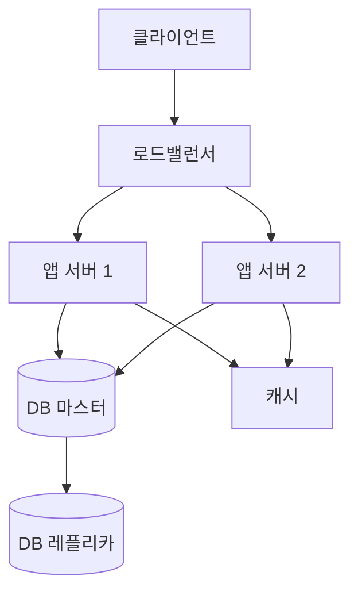

# 시스템 아키텍처 정의서: {{PROJECT_NAME_KR}}

## 인프라 구성

| 구성 요소 | 역할 | 스펙/기술 | 수량 |
|----------|------|----------|------|
| 웹 서버 | 트래픽 라우팅 | {{WEB_SERVER_TECH}} | {{WEB_COUNT}} |
| 앱 서버 | 비즈니스 로직 | {{APP_SERVER_TECH}} | {{APP_COUNT}} |
| DB 서버 | 데이터 저장 | {{DB_TECH}} | {{DB_COUNT}} |
| 캐시 서버 | 성능 최적화 | {{CACHE_TECH}} | {{CACHE_COUNT}} |
| 메시지 브로커 | 비동기 처리 | {{MQ_TECH}} | {{MQ_COUNT}} |

## 배포 다이어그램

> ⚠️ TODO: 실제 인프라에 맞게 수정

## 환경 구성

| 환경 | 목적 | 인프라 | 접근 제어 |
|------|------|--------|-----------|
| dev | 개발·단위 테스트 | {{DEV_INFRA}} | 개발팀 |
| staging | 통합 테스트·QA | {{STG_INFRA}} | 개발팀 + QA |
| prod | 운영 | {{PROD_INFRA}} | 배포 자동화만 허용 |

## 확장 전략

- **수평 확장**: {{HORIZONTAL_SCALE_STRATEGY}}
- **수직 확장**: {{VERTICAL_SCALE_STRATEGY}}
- **오토스케일링 기준**: CPU {{CPU_THRESHOLD}}% / 메모리 {{MEM_THRESHOLD}}%

## 관련 문서

- [SW 아키텍처 기술서](software-architecture.md)
- [보안 정의서](security-definition.md)
- [형상 관리 절차서](../06-management/config-management.md)
